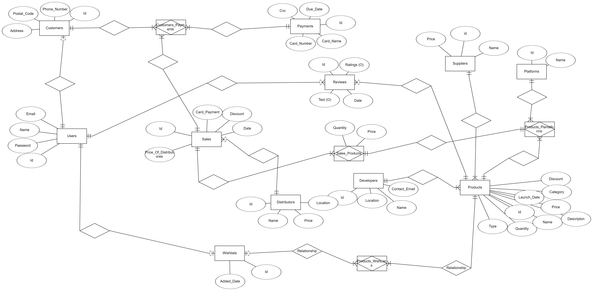

# PowerGuild Database Documentation

## Overview
This document provides an overview of the SQL script used to create and manage the database for the PowerGuild application. The database is structured to handle various entities such as platforms, developers, payments, suppliers, distributors, users, customers, products, sales, reviews, wishlists, and their relationships.

## Database Schema

### Tables
1. **Platforms**
   - `id`: Primary key, auto-increment.
   - `name`: Name of the platform.

2. **Developers**
   - `id`: Primary key, auto-increment.
   - `name`: Name of the developer.
   - `location`: Location of the developer.
   - `contact_email`: Contact email of the developer.

3. **Payments**
   - `id`: Primary key, auto-increment.
   - `card_name`: Name on the card.
   - `card_number`: Card number.
   - `cvc`: Card verification code.
   - `due_date`: Expiry date of the card.

4. **Suppliers**
   - `id`: Primary key, auto-increment.
   - `name`: Name of the supplier.
   - `price`: Price offered by the supplier.

5. **Distributors**
   - `id`: Primary key, auto-increment.
   - `name`: Name of the distributor.
   - `price`: Price set by the distributor.
   - `location`: Location of the distributor.

6. **Users**
   - `id`: Primary key, auto-increment.
   - `name`: Name of the user.
   - `email`: Email of the user.
   - `pwd`: Password of the user.

7. **Customers**
   - `id`: Primary key, auto-increment.
   - `address`: Address of the customer.
   - `postal_code`: Postal code of the customer.
   - `phone_number`: Phone number of the customer.
   - `fk_user_id`: Foreign key referencing `Users`.

8. **Products**
   - `id`: Primary key, auto-increment.
   - `name`: Name of the product.
   - `description`: Description of the product.
   - `discount`: Discount on the product.
   - `price`: Price of the product.
   - `quantity`: Quantity available.
   - `launch_date`: Launch date of the product.
   - `Type`: Type of the product (Physical or Non-Physical).
   - `category`: Category of the product.
   - `fk_developers_id`: Foreign key referencing `Developers`.
   - `fk_wishlist_id`: Foreign key referencing `Wishlists`.

9. **Sales**
   - `id`: Primary key, auto-increment.
   - `date`: Date of the sale.
   - `price`: Total price.
   - `discount`: Discount offered.
   - `quantity`: Quantity sold.
   - `priceDistributors`: Price from distributors.

10. **Reviews**
    - `id`: Primary key, auto-increment.
    - `ratings`: Ratings given.
    - `review_text`: Text of the review.
    - `review_date`: Date of the review.
    - `fk_user_id`: Foreign key referencing `Users`.
    - `fk_product_id`: Foreign key referencing `Products`.

11. **Wishlists**
    - `id`: Primary key, auto-increment.
    - `added_date`: Date added to wishlist.
    - `fk_user_id`: Foreign key referencing `Users`.
    - `fk_product_id`: Foreign key referencing `Products`.

12. **Customers Payments**
    - `fk_customers_id`: Foreign key referencing `Customers`.
    - `fk_payments_id`: Foreign key referencing `Payments`.
    - `fk_sales_id`: Foreign key referencing `Sales`.

13. **Products Platforms**
    - `fk_platforms_id`: Foreign key referencing `Platforms`.
    - `fk_sales_id`: Foreign key referencing `Sales`.
    - `fk_products_id`: Foreign key referencing `Products`.

14. **Sales Products**
    - `fk_products_id`: Foreign key referencing `Products`.
    - `fk_sales_id`: Foreign key referencing `Sales`.

### Relationships
- Foreign key constraints are used to maintain referential integrity between tables.

## Usage
- This script should be run in a MySQL-compatible database system.
- Ensure that the database `powerguild` is selected before executing the script.

## Notes
- The script uses `DEFAULT CHARSET = utf8` for certain tables to support a wide range of characters.
- Ensure that your database user has sufficient privileges to create tables and modify them.

This README provides a basic guide to the structure and purpose of the database tables and relationships defined in the `script.sql`.